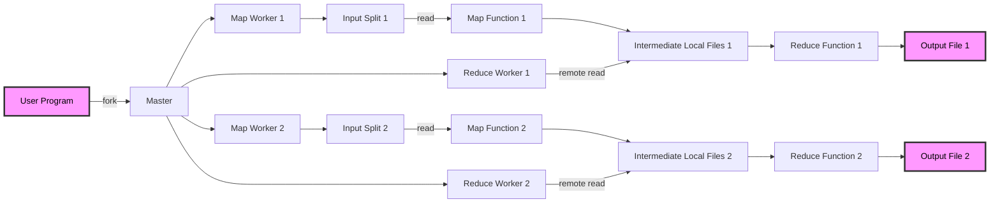

# Do Hadoop ao Lakehouse: O Legado do Ecossistema e a Relevância Contemporânea do Hive e do HDFS para Ecossistemas Modernos de Big Data

>Antes do surgimento do Apache Spark, dos frameworks transacionais como o Delta Lake e das arquiteturas unificadas conhecidas como Data Lakehouse, o Apache Hadoop protagonizou a primeira grande revolução na engenharia de dados em larga escala. Ao adotar um modelo distribuído de processamento sobre clusters de hardware comum, redefiniu os limites do tratamento massivo de informações e inaugurou o paradigma do Big Data na década de 2010. Com o amadurecimento do ecossistema, contudo, sua complexidade operacional e o acoplamento excessivo entre componentes tornaram-se evidentes. O avanço de motores em memória, como o Spark, e a consolidação do armazenamento em object stores deslocaram o Hadoop de seu papel central. Ainda assim, dois de seus pilares — o HDFS e o Hive — mantiveram relevância técnica: o primeiro, em nichos que exigem controle físico de blocos e tolerância a falhas extremas; o segundo, como catálogo de metadados que viabiliza a interoperabilidade entre motores modernos de processamento e análise. Assim, o Hive e o HDFS não apenas resistem como heranças tecnológicas do Hadoop, mas representam a ponte conceitual entre o modelo clássico de processamento distribuído e as arquiteturas contemporâneas de dados governados.

## 1. Visão Geral

O Apache Hadoop emergiu como a primeira infraestrutura de processamento distribuído amplamente adotada, fundamentada em dois pilares conceituais: o Hadoop Distributed File System (HDFS) e o modelo de programação MapReduce. Inspirado nos artigos do Google sobre o Google File System (GFS) e o MapReduce Framework, o Hadoop foi concebido em 2006 por Doug Cutting e Mike Cafarella, com o objetivo de democratizar o processamento massivo de dados utilizando clusters de hardware comum (commodity hardware).

Durante a década seguinte, o Hadoop tornou-se sinônimo de Big Data. Seu ecossistema cresceu de forma acelerada, incorporando subprojetos complementares que cobriam diferentes etapas do ciclo de dados:

- **HDFS**: armazenamento distribuído em blocos redundantes;
- **MapReduce**: processamento paralelo e tolerante a falhas;
- **YARN**: gerenciamento de recursos e agendamento de tarefas;
- **Hive, Pig e HBase**: abstrações de alto nível para consulta e manipulação;
- **Sqoop, Flume e Oozie**: ferramentas de integração, ingestão e orquestração.

Esse conjunto formava a chamada Hadoop Ecosystem Stack, base tecnológica de data centers corporativos e acadêmicos durante a década de 2010. A arquitetura, entretanto, apresentava características monolíticas: o acoplamento entre armazenamento, processamento e orquestração dificultava a elasticidade e a adoção em ambientes nativos de nuvem. O crescimento da complexidade operacional — dependência de múltiplos serviços, tuning manual de parâmetros, alto consumo de recursos — reduziu a atratividade do modelo.

Com o advento de motores em memória, como o Apache Spark, e de armazenamentos desacoplados, baseados em object stores (S3, MinIO, Azure Blob), a arquitetura Hadoop tornou-se gradualmente obsoleta enquanto plataforma de execução. Contudo, seus fundamentos conceituais permaneceram estruturantes para a evolução posterior da engenharia de dados: paralelismo massivo, resiliência por replicação, e abstração de dados em escala de petabytes.

No cenário contemporâneo, o Hadoop sobrevive não mais como ecossistema operacional completo, mas como legado arquitetural. O HDFS ainda é empregado em implementações que requerem controle físico granular e alta disponibilidade em ambientes isolados (por exemplo, clusters on-premises com políticas de segurança restritivas). Já o Hive, projetado originalmente como uma camada SQL sobre o HDFS, evoluiu para o papel de catálogo de metadados universal, interoperando com engines modernos como Spark, Dremio, Presto e Trino.

Assim, compreender o Hadoop é compreender a genealogia das arquiteturas modernas de dados: o Lakehouse não o substitui, mas o sucede, herdando seus princípios e reconfigurando-os sob novas abstrações de governança, elasticidade e integração multi-engine.

# 2. Transição da Pilha Hadoop à Arquitetura Lakehouse Moderna

A evolução do ecossistema de Big Data pode ser compreendida como uma substituição progressiva de camadas acopladas por componentes desacoplados e interoperáveis, mantendo o mesmo propósito funcional, mas sob princípios distintos: elasticidade, independência entre computação e armazenamento e governança transacional.

| Camada / Função Original           | Hadoop Ecosystem (2008–2015)                | Equivalentes na Arquitetura Moderna (2016–2025)                 | Observações |
|-----------------------------------|---------------------------------------------|------------------------------------------------------------------|-------------|
| **Armazenamento Distribuído**     | HDFS (Hadoop Distributed File System)       | Object Stores (S3, MinIO, Azure Blob)                            | Substitui replicação física por redundância em nuvem; separa armazenamento e computação. |
| **Processamento Paralelo**        | MapReduce                                  | Apache Spark / Dask / Ray                                        | In-memory computing, APIs de alto nível e suporte a streaming. |
| **Gerenciamento de Recursos**     | YARN                                       | Kubernetes / Docker Compose / Spark Standalone                   | Gerência elástica e isolamento de execução. |
| **Consultas SQL e Metadados**     | Hive                                       | Hive Metastore / AWS Glue / Unity Catalog / Nessie               | O Hive persiste como catálogo universal, agora desacoplado do HDFS. |
| **Ingestão e Orquestração**       | Flume / Sqoop / Oozie                      | Airflow / Kafka / Debezium / dbt                                 | Pipelines declarativos e integração com sistemas transacionais. |
| **Armazenamento Transacional**    | *(Inexistente no modelo original)*          | Delta Lake / Apache Hudi / Apache Iceberg                        | Implementa ACID, versionamento e schema enforcement em object stores. |
| **Motor de Consulta / Virtualização** | Pig / HBase / Impala                        | Dremio / Trino / Presto / DuckDB                                 | Engines SQL de alto desempenho com pushdown e cache distribuído. |
| **Visualização e BI**             | *(Limitado ou ausente)*                    | Metabase / Superset / Grafana / Power BI                         | Democratiza o consumo de dados e entrega visual de indicadores. |

> Essa substituição não representa uma ruptura, mas uma reengenharia evolutiva: o Hadoop estabeleceu os fundamentos técnicos que possibilitaram o surgimento das arquiteturas Lakehouse e de seus componentes interoperáveis.

<!--
 -->

