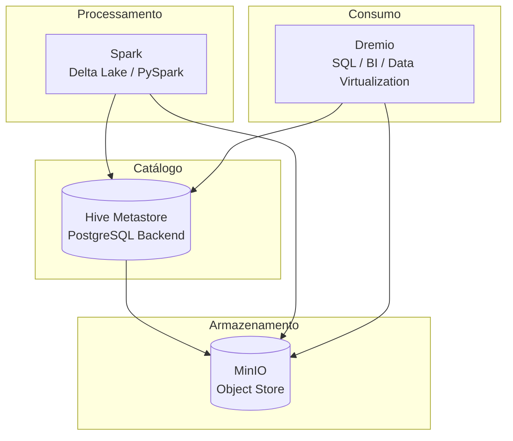

# Hive como Catálogo de Metadados na Transição do Hadoop ao Lakehouse

>Antes do surgimento do Apache Spark, dos frameworks transacionais como o Delta Lake e das arquiteturas unificadas conhecidas como Data Lakehouse, o Apache Hadoop protagonizou a primeira grande revolução na engenharia de dados em larga escala. Ao adotar um modelo distribuído de processamento sobre clusters de hardware comum, redefiniu os limites do tratamento massivo de informações e inaugurou o paradigma do Big Data a partir de meados da década de 2000. Com o amadurecimento do ecossistema, contudo, sua complexidade operacional e o acoplamento excessivo entre componentes tornaram-se evidentes. O avanço de motores em memória, como o Spark, e a consolidação do armazenamento em object stores deslocaram o Hadoop de seu papel central. Ainda assim, dois de seus pilares — o HDFS e o Hive — mantiveram relevância técnica: o primeiro, em nichos que exigem controle físico de blocos e tolerância a falhas extremas; o segundo, como catálogo de metadados que viabiliza a interoperabilidade entre motores modernos de processamento e análise. Assim, o Hive e o HDFS não apenas resistem como heranças tecnológicas do Hadoop, mas representam a ponte conceitual entre o modelo clássico de processamento distribuído e as arquiteturas contemporâneas de dados governados.

## 1. Visão Geral

O Apache Hadoop emergiu como a primeira infraestrutura de processamento distribuído amplamente adotada, fundamentada em dois pilares conceituais: o Hadoop Distributed File System (HDFS) e o modelo de programação MapReduce. Inspirado nos artigos do Google sobre o Google File System (GFS) e o MapReduce Framework, o Hadoop foi concebido em 2006 por Doug Cutting e Mike Cafarella, com o objetivo de democratizar o processamento massivo de dados utilizando clusters de hardware comum (commodity hardware).

Durante a década seguinte, o Hadoop tornou-se sinônimo de Big Data. Seu ecossistema cresceu de forma acelerada, incorporando subprojetos complementares que cobriam diferentes etapas do ciclo de dados:

- **HDFS**: armazenamento distribuído em blocos redundantes;
- **MapReduce**: processamento paralelo e tolerante a falhas;
- **YARN**: gerenciamento de recursos e agendamento de tarefas;
- **Hive, Pig e HBase**: abstrações de alto nível para consulta e manipulação;
- **Sqoop, Flume e Oozie**: ferramentas de integração, ingestão e orquestração.

Esse conjunto formava a chamada Hadoop Ecosystem Stack, base tecnológica de data centers corporativos e acadêmicos durante a década de 2010. A arquitetura, entretanto, apresentava características monolíticas: o acoplamento entre armazenamento, processamento e orquestração dificultava a elasticidade e a adoção em ambientes nativos de nuvem. O crescimento da complexidade operacional — dependência de múltiplos serviços, tuning manual de parâmetros, alto consumo de recursos — reduziu a atratividade do modelo.

Com o advento de motores em memória, como o Apache Spark, e de armazenamentos desacoplados, baseados em object stores (S3, MinIO, Azure Blob), a arquitetura Hadoop tornou-se gradualmente obsoleta enquanto plataforma de execução. Contudo, seus fundamentos conceituais permaneceram estruturantes para a evolução posterior da engenharia de dados: paralelismo massivo, resiliência por replicação, e abstração de dados em escala de petabytes.

No cenário contemporâneo, o Hadoop sobrevive não mais como ecossistema operacional completo, mas como legado arquitetural. O HDFS ainda é empregado em implementações que requerem controle físico granular e alta disponibilidade em ambientes isolados (por exemplo, clusters on-premises com políticas de segurança restritivas). Já o Hive, projetado originalmente como uma camada SQL sobre o HDFS, evoluiu para o papel de catálogo de metadados universal, interoperando com engines modernos como Spark, Dremio, Presto e Trino.

Assim, compreender o Hadoop é compreender a genealogia das arquiteturas modernas de dados: o Lakehouse não o substitui, mas o sucede, herdando seus princípios e reconfigurando-os sob novas abstrações de governança, elasticidade e integração multi-engine.

## 2. Transição da Pilha Hadoop à Arquitetura Lakehouse Moderna

A evolução do ecossistema de Big Data pode ser compreendida como uma substituição progressiva de camadas acopladas por componentes desacoplados e interoperáveis, mantendo o mesmo propósito funcional, mas sob princípios distintos: elasticidade, independência entre computação e armazenamento e governança transacional.

| Camada / Função Original           | Hadoop Ecosystem (2008–2015)                | Equivalentes na Arquitetura Moderna (2016–2025)                 | Observações |
|-----------------------------------|---------------------------------------------|------------------------------------------------------------------|-------------|
| **Armazenamento Distribuído**     | HDFS (Hadoop Distributed File System)       | Object Stores (S3, MinIO, Azure Blob)                            | Substitui replicação física por redundância em nuvem; separa armazenamento e computação. |
| **Processamento Paralelo**        | MapReduce                                  | Apache Spark / Dask / Ray                                         | In-memory computing, APIs de alto nível e suporte a streaming. |
| **Gerenciamento de Recursos**     | YARN                                       | Kubernetes / Docker Compose                                       | Gerência, orquestração e isolamento de execução. |
| **Consultas SQL e Metadados**     | Hive                                       | Hive Metastore / AWS Glue / Unity Catalog / Nessie               | O Hive persiste como catálogo universal, agora desacoplado do HDFS. |
| **Ingestão e Orquestração**       | Flume / Sqoop / Oozie                      | Airflow / Kafka                                                  | Pipelines declarativos e integração com sistemas transacionais. |
| **Armazenamento Transacional**    | *(Inexistente no modelo original)*          | Delta Lake / Apache Hudi / Apache Iceberg                        | Implementa ACID, versionamento e schema enforcement em object stores. |
| **Motor de Consulta / Virtualização** | Pig / HBase / Impala                        | Dremio / Trino / Presto / DuckDB                                 | Engines SQL de alto desempenho com pushdown e cache distribuído. |
| **Visualização e BI**             | *(Limitado ou ausente)*                    | Metabase / Superset / Grafana / Power BI                         | Democratiza o consumo de dados e entrega visual de indicadores. |

> Essa substituição paulatina não representa uma ruptura completa, mas pode ser compreendido como uma reengenharia evolutiva: o Hadoop estabeleceu os fundamentos técnicos que possibilitaram o surgimento das arquiteturas modernas Lakehouse e de seus componentes interoperáveis.

## 3. O Hive como Catálogo Universal de Metadados

A consolidação das arquiteturas baseadas em object stores e motores de processamento desacoplados exigiu uma nova camada de integração: um catálogo de metadados persistente, capaz de descrever a estrutura lógica dos dados independentemente do mecanismo que os acessa. Nesse contexto, o Apache Hive, originalmente criado pelo Facebook em 2008 como um tradutor de consultas SQL para MapReduce, passou por uma transformação fundamental. O que sobreviveu ao declínio do Hadoop não foi o seu mecanismo de execução, mas o Hive Metastore — o serviço responsável por armazenar e disponibilizar metadados de tabelas, esquemas e partições.

### 3.1. Do SQL Engine ao Metastore

Na arquitetura original do Hadoop, o Hive convertia instruções SQL em jobs MapReduce, executados sobre o HDFS. Esse modelo, embora inovador à época, tornava-se lento e custoso conforme o volume de dados crescia. Com o avanço dos motores em memória (Spark, Presto, Dremio), o componente de execução do Hive perdeu relevância, mas o Metastore permaneceu essencial — funcionando como um catálogo centralizado de metadados.

Hoje, o Hive Metastore é o repositório lógico que unifica a visão dos dados armazenados em sistemas distribuídos, permitindo que diferentes motores consultem as mesmas tabelas com consistência semântica. Ele não armazena dados, mas mantém o mapeamento entre o nome lógico da tabela e sua localização física, além de registrar tipos de dados, partições e estatísticas.

| Função                                | Descrição                                                   |
| ------------------------------------- | ----------------------------------------------------------- |
| **Catálogo de Schemas**               | Registra bancos, tabelas e partições.                       |
| **Compatibilidade Multi-Engine**      | Pode ser acessado por Spark, Dremio, Presto, Trino e Flink. |
| **Persistência via Banco Relacional** | Armazena metadados em PostgreSQL, MySQL ou Derby.           |
| **Interface Thrift**                  | Exposição via API padrão (`thrift://host:9083`).            |

Essa separação funcional permitiu que o Hive sobrevivesse à obsolescência do Hadoop, tornando-se um componente neutro e interoperável entre ecossistemas.

### 3.2. Arquitetura Moderna de Integração

No contexto atual, o Hive Metastore é o elo entre armazenamento distribuído (MinIO/S3) e motores analíticos (Spark e Dremio). Ele fornece uma camada de governança e descoberta de metadados compartilhada, essencial para manter consistência entre transformações e consultas.

```mermaid
graph LR
  subgraph Armazenamento
    M[(MinIO / S3 / HDFS)]
  end

  subgraph Catálogo
    H[(Hive Metastore<br>PostgreSQL Backend)]
  end

  subgraph Processamento
    S[Spark<br>(Leitura/Escrita ACID<br>Delta Lake)]
  end

  subgraph Consumo
    D[Dremio<br>(Virtualização e SQL Pushdown)]
  end

  S --> H
  D --> H
  H --> M
```

O Hive Metastore atua como uma “camada de coerência” dentro da arquitetura moderna. Ele garante que o mesmo conjunto de dados — armazenado em um object store — seja interpretado da mesma forma por diferentes mecanismos de consulta e transformação, evitando divergências entre camadas analítica e transacional. Na prática desta disciplina, o Hive será executado em contêiner próprio, com metadados persistidos em PostgreSQL. Essa configuração simula a arquitetura utilizada em ambientes corporativos, em que o catálogo serve simultaneamente:

> ao Spark, que registra e consulta tabelas durante a execução de pipelines Delta Lake; e ao Dremio, que descobre automaticamente essas tabelas e as expõe para consultas SQL e visualização no Metabase.

A conexão entre os componentes ocorre via serviço Thrift (`hive-metastore:9083`), enquanto o banco PostgreSQL armazena as definições lógicas (*schemas*, partições, localizações). Esse arranjo reflete um padrão de interoperabilidade comum em arquiteturas Lakehouse e ilustra a importância do Hive como componente de governança estrutural — não mais como engine de execução, mas como infraestrutura de metadados.

## 4. Implementação do Hive com Spark e Dremio

A arquitetura moderna de dados requer interoperabilidade entre diferentes motores de processamento e análise. Para isso, o Hive Metastore atua como o catálogo centralizado de metadados, permitindo que tabelas criadas ou atualizadas no Spark (via Delta Lake) sejam automaticamente reconhecidas por motores de consulta como o Dremio.



>O Hive Metastore fornece o elo semântico entre o armazenamento físico (MinIO) e os mecanismos lógicos de consulta e transformação. Isso garante que todos os motores compartilhem uma mesma visão de esquema, partição e localização das tabelas.

Com os contêineres ativos, o Hive Metastore poderá ser verificado através da CLI do Hive ou via Spark:

```bash
docker exec -it spark spark-sql --master local \
  --conf spark.sql.catalogImplementation=hive \
  --conf hive.metastore.uris=thrift://hive-metastore:9083
```

No prompt, comandos como confirmam a comunicação correta entre Spark e o catálogo:

```sql
SHOW DATABASES;
SHOW TABLES IN default;
DESCRIBE FORMATTED minha_tabela_delta;
```

